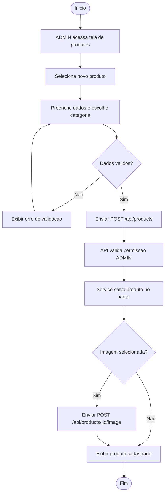

# Diagrama de Atividade 01 - Cadastro de Produto

```mermaid
flowchart TD
  A([Inicio]) --> B[ADMIN acessa tela de produtos]
  B --> C[Seleciona novo produto]
  C --> D[Preenche dados e escolhe categoria]
  D --> E{Dados validos?}
  E -- Nao --> F[Exibir erro de validacao]
  F --> D
  E -- Sim --> G[Enviar POST /api/products]
  G --> H[API valida permissao ADMIN]
  H --> I[Service salva produto no banco]
  I --> J{Imagem selecionada?}
  J -- Nao --> L[Exibir produto cadastrado]
  J -- Sim --> K[Enviar POST /api/products/:id/image]
  K --> L
  L --> M([Fim])
```

