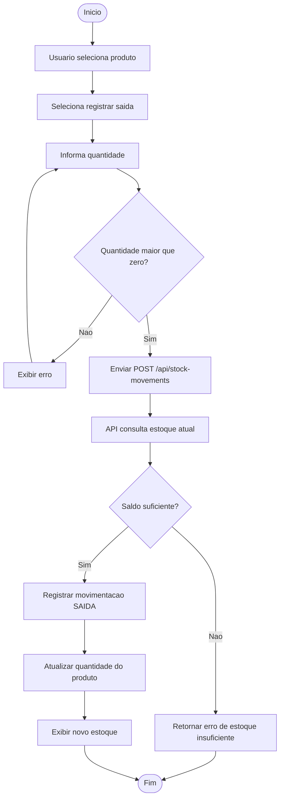

# Diagrama de Atividade 02 - Saida de Estoque

```mermaid
flowchart TD
  A([Inicio]) --> B[Usuario seleciona produto]
  B --> C[Seleciona registrar saida]
  C --> D[Informa quantidade]
  D --> E{Quantidade maior que zero?}
  E -- Nao --> F[Exibir erro]
  F --> D
  E -- Sim --> G[Enviar POST /api/stock-movements]
  G --> H[API consulta estoque atual]
  H --> I{Saldo suficiente?}
  I -- Nao --> J[Retornar erro de estoque insuficiente]
  I -- Sim --> K[Registrar movimentacao SAIDA]
  K --> L[Atualizar quantidade do produto]
  L --> M[Exibir novo estoque]
  J --> N([Fim])
  M --> N
```

