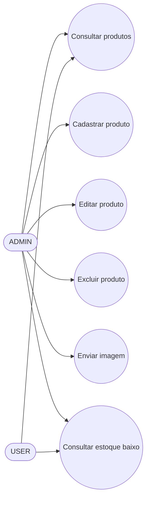

# Caso de Uso 01 - Gerenciamento de Produtos

```mermaid
flowchart LR
  Admin([ADMIN])
  User([USER])

  UC1((Consultar produtos))
  UC2((Cadastrar produto))
  UC3((Editar produto))
  UC4((Excluir produto))
  UC5((Enviar imagem))
  UC6((Consultar estoque baixo))

  Admin --> UC1
  Admin --> UC2
  Admin --> UC3
  Admin --> UC4
  Admin --> UC5
  Admin --> UC6
  User --> UC1
  User --> UC6
```

