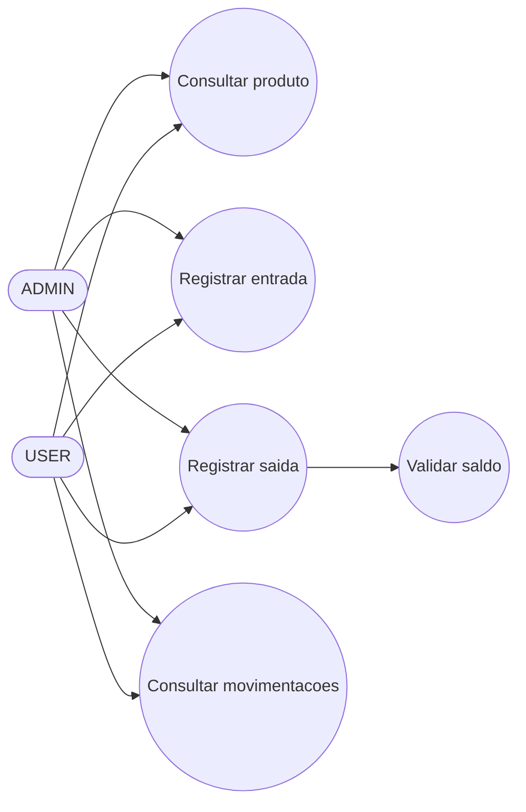

# Caso de Uso 02 - Movimentacao de Estoque

```mermaid
flowchart LR
  Admin([ADMIN])
  User([USER])

  UC1((Consultar produto))
  UC2((Registrar entrada))
  UC3((Registrar saida))
  UC4((Consultar movimentacoes))
  UC5((Validar saldo))

  Admin --> UC1
  Admin --> UC2
  Admin --> UC3
  Admin --> UC4
  User --> UC1
  User --> UC2
  User --> UC3
  User --> UC4
  UC3 --> UC5
```

