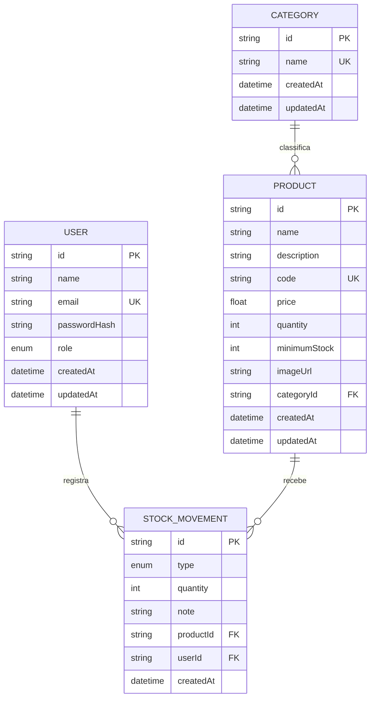

# Diagrama Entidade Relacionamento

```mermaid
erDiagram
  USER ||--o{ STOCK_MOVEMENT : registra
  CATEGORY ||--o{ PRODUCT : classifica
  PRODUCT ||--o{ STOCK_MOVEMENT : recebe

  USER {
    string id PK
    string name
    string email UK
    string passwordHash
    enum role
    datetime createdAt
    datetime updatedAt
  }

  CATEGORY {
    string id PK
    string name UK
    datetime createdAt
    datetime updatedAt
  }

  PRODUCT {
    string id PK
    string name
    string description
    string code UK
    float price
    int quantity
    int minimumStock
    string imageUrl
    string categoryId FK
    datetime createdAt
    datetime updatedAt
  }

  STOCK_MOVEMENT {
    string id PK
    enum type
    int quantity
    string note
    string productId FK
    string userId FK
    datetime createdAt
  }
```

