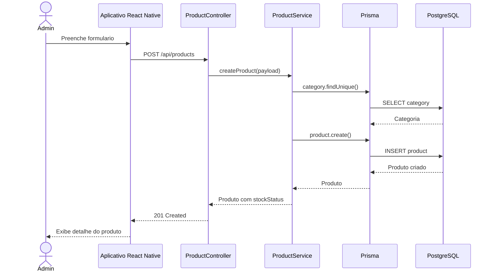

# Diagrama de Sequencia 01 - Cadastro de Produto

```mermaid
sequenceDiagram
  actor Admin
  participant App as Aplicativo React Native
  participant Controller as ProductController
  participant Service as ProductService
  participant Prisma
  participant DB as PostgreSQL

  Admin->>App: Preenche formulario
  App->>Controller: POST /api/products
  Controller->>Service: createProduct(payload)
  Service->>Prisma: category.findUnique()
  Prisma->>DB: SELECT category
  DB-->>Prisma: Categoria
  Service->>Prisma: product.create()
  Prisma->>DB: INSERT product
  DB-->>Prisma: Produto criado
  Prisma-->>Service: Produto
  Service-->>Controller: Produto com stockStatus
  Controller-->>App: 201 Created
  App-->>Admin: Exibe detalhe do produto
```

