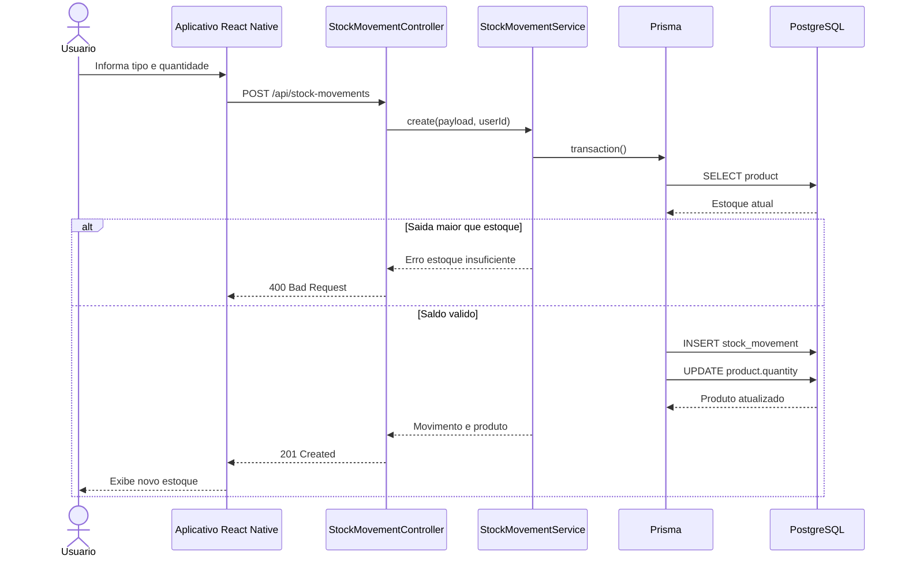

# Diagrama de Sequencia 02 - Movimentacao de Estoque

```mermaid
sequenceDiagram
  actor Usuario
  participant App as Aplicativo React Native
  participant Controller as StockMovementController
  participant Service as StockMovementService
  participant Prisma
  participant DB as PostgreSQL

  Usuario->>App: Informa tipo e quantidade
  App->>Controller: POST /api/stock-movements
  Controller->>Service: create(payload, userId)
  Service->>Prisma: transaction()
  Prisma->>DB: SELECT product
  DB-->>Prisma: Estoque atual
  alt Saida maior que estoque
    Service-->>Controller: Erro estoque insuficiente
    Controller-->>App: 400 Bad Request
  else Saldo valido
    Prisma->>DB: INSERT stock_movement
    Prisma->>DB: UPDATE product.quantity
    DB-->>Prisma: Produto atualizado
    Service-->>Controller: Movimento e produto
    Controller-->>App: 201 Created
    App-->>Usuario: Exibe novo estoque
  end
```

